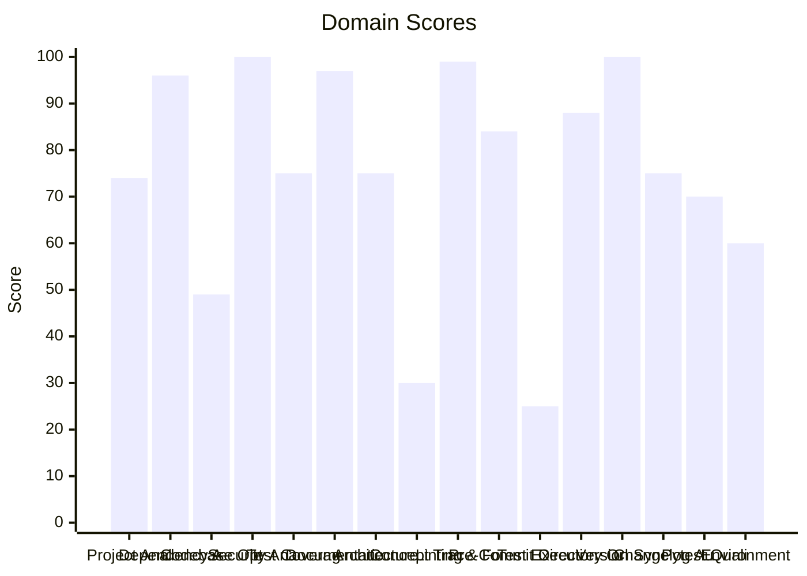

# 🔬 Code Enhancement Report

> **Generated**: 2026-05-22 22:25:06 UTC | **Target**: arr-mcp | **Overall GPA**: 2.31/4.0

---

## 📊 Executive Summary

| Domain | Grade | Score | Status |
|--------|-------|-------|--------|
| Test Execution | 🔴 F | 25/100 | `█████░░░░░░░░░░░░░░░` 25/100 |
| Concept Traceability | 🔴 F | 30/100 | `██████░░░░░░░░░░░░░░` 30/100 |
| Codebase Optimization | 🔴 F | 49/100 | `█████████░░░░░░░░░░░` 49/100 |
| Environment Variables | 🟠 D | 60/100 | `████████████░░░░░░░░` 60/100 |
| Pytest Quality | 🟡 C | 70/100 | `██████████████░░░░░░` 70/100 |
| Project Analysis | 🟡 C | 74/100 | `██████████████░░░░░░` 74/100 |
| Test Coverage | 🟡 C | 75/100 | `███████████████░░░░░` 75/100 |
| Architecture & Design Patterns | 🟡 C | 75/100 | `███████████████░░░░░` 75/100 |
| Changelog Audit | 🟡 C | 75/100 | `███████████████░░░░░` 75/100 |
| Pre-Commit Compliance | 🔵 B | 84/100 | `████████████████░░░░` 84/100 |
| Directory Organization | 🔵 B | 88/100 | `█████████████████░░░` 88/100 |
| Dependency Audit | 🟢 A | 96/100 | `███████████████████░` 96/100 |
| Documentation & Governance | 🟢 A | 97/100 | `███████████████████░` 97/100 |
| Linting & Formatting | 🟢 A | 99/100 | `███████████████████░` 99/100 |
| Security Analysis | 🟢 A | 100/100 | `████████████████████` 100/100 |
| Version Sync Analysis | 🟢 A | 100/100 | `████████████████████` 100/100 |

---

## 📋 Domain Scorecards

### Project Analysis — 🟡 Grade: C (74/100)

`██████████████░░░░░░` 74/100

> [!NOTE]
> Detected ecosystem marker: agent-utilities → Agent-Utilities Ecosystem

| Criterion | Points | Evidence | Reasoning |
|-----------|--------|----------|-----------|
| has_pyproject | 10 | `pyproject.toml and requirements.txt` | Both pyproject.toml and requirements.txt exist, fulfilling mandatory Python proj |
| project_type_detected | 10 | `Agent-Utilities Ecosystem` | Identified 1 ecosystem marker(s) in dependencies |
| externalized_prompts | 0 | `/home/apps/workspace/agent-packages/agents/arr-mcp` | No prompts/ directory found. Prompts may be hardcoded in source. |
| observability | 0 | `dependency list` | No observability tools (logfire, sentry, opentelemetry) found |
| testing_suite | 10 | `tests dir: True, pytest dep: True` | Tests directory exists, pytest in dependencies |
| agents_md | 10 | `/home/apps/workspace/agent-packages/agents/arr-mcp/AGENTS.md` | AGENTS.md exists with comprehensive content |
| pre_commit_hooks | 10 | `/home/apps/workspace/agent-packages/agents/arr-mcp/.pre-comm` | Pre-commit configuration found for automated code quality checks |
| gitignore | 10 | `/home/apps/workspace/agent-packages/agents/arr-mcp/.gitignor` | .gitignore exists to prevent committing build artifacts and secrets |
| env_template | 10 | `/home/apps/workspace/agent-packages/agents/arr-mcp/.env.exam` | Environment template exists for onboarding and secret management |
| protocol_support | 4 | `MCP` | 1 communication protocol(s) detected |

**Findings:**
- Protocol support: MCP

---

### Dependency Audit — 🟢 Grade: A (96/100)

`███████████████████░` 96/100

> [!TIP]
> Minor update: urllib3 2.6.3 (installed) -> 2.7.0

| Criterion | Points | Evidence | Reasoning |
|-----------|--------|----------|-----------|
| dependency_freshness | 96 | `source=/home/apps/workspace/agent-packages/agents/arr-mcp/py` | Audited 8 deps (8 installed, 0 constraint-only). 0 major, 1 minor, 1 patch updat |

---

### Codebase Optimization — 🔴 Grade: F (49/100)

`█████████░░░░░░░░░░░` 49/100

> [!CAUTION]
> 1 functions exceed 200 lines (actionable refactoring targets): get_mcp_instance (320L)

| Criterion | Points | Evidence | Reasoning |
|-----------|--------|----------|-----------|
| code_quality | 49 | `{"file_count": 25, "total_lines": 11649, "function_count": 1` | Analyzed 25 files, 1209 functions. Avg CC=1.8, max length=320, duplication=24.8% |

**Findings:**
- Monolithic: api_client_prowlarr.py (1211L) — 2 functions with high complexity (worst: Api.get_indexer_id_newznab at 105L, CC=33); God class: Api (131 methods) — consider mixins/composition
- Needs attention: api_client_sonarr.py (2002L) — God class: Api (238 methods) — consider mixins/composition
- Needs attention: api_client_radarr.py (1919L) — God class: Api (241 methods) — consider mixins/composition
- Needs attention: api_client_lidarr.py (1941L) — God class: Api (237 methods) — consider mixins/composition

---

### Security Analysis — 🟢 Grade: A (100/100)

`████████████████████` 100/100

| Criterion | Points | Evidence | Reasoning |
|-----------|--------|----------|-----------|
| security_posture | 100 | `high=0 med=0 low=0 attack_surface={"subprocess_calls": 0, "f` | Scanned 25 files. Found 0 security findings. High: -0pts, Med: -0pts, Low: -0pts |

---

### Test Coverage — 🟡 Grade: C (75/100)

`███████████████░░░░░` 75/100

> [!NOTE]
> Test suite lacks intent diversity (only one type)

| Criterion | Points | Evidence | Reasoning |
|-----------|--------|----------|-----------|
| test_coverage_quality | 75 | `{"test_file_count": 6, "test_count": 26, "source_file_count"` | 26 tests across 6 files. Ratio: 1.04. Intent: {'unit': 26}. 5 without assertions |

**Findings:**
- 12 potential doc-test drift items

---

### Documentation & Governance — 🟢 Grade: A (97/100)

`███████████████████░` 97/100

> [!TIP]
> README.md missing sections: usage|quick start

| Criterion | Points | Evidence | Reasoning |
|-----------|--------|----------|-----------|
| documentation_quality | 97 | `{"README.md": {"exists": true, "missing": ["usage|quick star` | Audited 6 standard docs + docs/ directory. 0 broken references, 5 docs present.  |

**Findings:**
- 2 broken internal links in README.md
- README missing: Has a Table of Contents
- README missing: Has usage examples with code blocks

---

### Architecture & Design Patterns — 🟡 Grade: C (75/100)

`███████████████░░░░░` 75/100

> [!NOTE]
> SRP: 6 modules exceed 500 lines (god modules)

| Criterion | Points | Evidence | Reasoning |
|-----------|--------|----------|-----------|
| architecture_quality | 75 | `{"layers": 0, "di_ratio": 0.73, "solid_violations": 2}` | Analyzed 25 files. 0/5 architecture layers present, DI ratio: 73%, 2 SOLID viola |

**Findings:**
- SRP: 7 classes have >15 methods
- No discernible layer architecture (no domain/service/adapter separation)

---

### Concept Traceability — 🔴 Grade: F (30/100)

`██████░░░░░░░░░░░░░░` 30/100

> [!CAUTION]
> Low traceability ratio: 0% concepts fully traced

| Criterion | Points | Evidence | Reasoning |
|-----------|--------|----------|-----------|
| concept_traceability | 30 | `{"total_concepts": 5, "well_traced": 0, "orphans": 5, "drift` | 5 unique concepts found. 0 fully traced (code+docs+tests), 5 orphans, 0 drifted. |

**Findings:**
- 26 test functions missing concept markers
- 163 significant functions (>10 lines) missing concept markers in docstrings

---

### Linting & Formatting — 🟢 Grade: A (99/100)

`███████████████████░` 99/100

> [!TIP]
> Total lint findings: 1 (high/error: 0, medium/warning: 0, low: 1)

| Criterion | Points | Evidence | Reasoning |
|-----------|--------|----------|-----------|
| lint_compliance | 99 | `ruff=1, bandit=0, mypy=0` | 1 total findings across 3 tools. High/error: -0pts, Med/warning: -0pts, Low: -1p |

---

### Pre-Commit Compliance — 🔵 Grade: B (84/100)

`████████████████░░░░` 84/100

> [!NOTE]
> 2/24 pre-commit hooks failed: don't commit to branch, check cli help

| Criterion | Points | Evidence | Reasoning |
|-----------|--------|----------|-----------|
| precommit_compliance | 84 | `{"total_hooks": 24, "passed": 21, "failed": 2, "skipped": 1,` | Ran pre-commit with 24 hooks: 21 passed, 2 failed, 1 skipped. 2 potentially outd |

**Findings:**
- 2 hook(s) may be outdated: ruff-pre-commit, uv-pre-commit
- Pytest hooks skipped (handled by CE-016 Test Execution): pytest, local-pytest

---

### Test Execution — 🔴 Grade: F (25/100)

`█████░░░░░░░░░░░░░░░` 25/100

> [!CAUTION]
> No tests were executed (test framework detected but no tests found)

| Criterion | Points | Evidence | Reasoning |
|-----------|--------|----------|-----------|
| test_execution | 25 | `{"frameworks_detected": 1, "total_passed": 0, "total_failed"` | Executed 1 framework(s). 0 passed, 0 failed, 0 errors. Pass rate: 0%. |

---

### Directory Organization — 🔵 Grade: B (88/100)

`█████████████████░░░` 88/100

> [!NOTE]
> 4 rogue/throwaway scripts detected (fix_*, validate_*, patch_*, etc.): patch_gen_script.py, fix_mcp_server.py, patch_gen.py, scripts/validate_a2a_agent.py

| Criterion | Points | Evidence | Reasoning |
|-----------|--------|----------|-----------|
| directory_organization | 88 | `{"total_source_files": 50, "total_directories": 10, "max_dep` | 50 files across 10 directories. Max depth: 3, avg files/dir: 5.0. 0 crowded, 0 s |

---

### Version Sync Analysis — 🟢 Grade: A (100/100)

`████████████████████` 100/100

> [!TIP]
> All version '0.15.0' declarations appear to be tracked correctly.

| Criterion | Points | Evidence | Reasoning |
|-----------|--------|----------|-----------|
| bumpversion_exists | 20 | `/home/apps/workspace/agent-packages/agents/arr-mcp/.bumpvers` | .bumpversion.cfg found |
| current_version_defined | 20 | `0.15.0` | Current version tracked is 0.15.0 |
| files_tracked | 20 | `5 files tracked` | Found 5 files tracked in .bumpversion.cfg |
| version_drift_check | 40 | `0 drifted files` | No version drift detected in codebase files |

---

### Changelog Audit — 🟡 Grade: C (75/100)

`███████████████░░░░░` 75/100

> [!NOTE]
> CHANGELOG.md exists but could not be parsed — check format compliance

| Criterion | Points | Evidence | Reasoning |
|-----------|--------|----------|-----------|
| changelog_quality | 75 | `{"exists": true, "parseable": false, "version_count": 0, "ha` | CHANGELOG.md exists. 0 versions tracked. 0 dependency changelogs analyzed. |

**Findings:**
- No changelog entries within the last 30 days
- keepachangelog not installed — pip install 'universal-skills[code-enhancer]'

---

### Pytest Quality — 🟡 Grade: C (70/100)

`██████████████░░░░░░` 70/100

> [!NOTE]
> 1 test files exceed 500 lines — split into focused modules

| Criterion | Points | Evidence | Reasoning |
|-----------|--------|----------|-----------|
| pytest_quality | 70 | `{"test_files": 6, "total_tests": 26, "descriptive_name_ratio` | 26 tests across 6 files. Naming: 20/20, Structure: 12/20, Fixtures: 8/20, Assert |

**Findings:**
- Test directory lacks subdirectory organization (consider unit/, integration/, e2e/)
- Missing conftest.py for shared fixtures
- Low fixture usage: only 19% of tests use fixtures
- No shared fixtures in conftest.py

---

### Environment Variables — 🟠 Grade: D (60/100)

`████████████░░░░░░░░` 60/100

> [!WARNING]
> Only 15% of env vars documented in README.md

| Criterion | Points | Evidence | Reasoning |
|-----------|--------|----------|-----------|
| env_var_documentation | 60 | `{"total_vars": 55, "python_vars": 29, "dockerfile_vars": 22,` | Found 55 unique env vars across 97 occurrences. README documents 8/55. Has .env. |

**Findings:**
- Undocumented env vars: ALLOWED_CLIENT_REDIRECT_URIS, AUTH_TYPE, BAZARR_API_KEY, BAZARR_BASE_URL, BAZARR_SSL_VERIFY, CHAPTARR_API_KEY, CHAPTARR_BASE_URL, CHAPTARR_SSL_VERIFY, CHAPTARR_TOKEN, DEFAULT_AGENT_NAME
- 27 Python env vars not in .env.example: BAZARR_API_KEY, BAZARR_BASE_URL, BAZARR_SSL_VERIFY, CHAPTARR_API_KEY, CHAPTARR_BASE_URL

---

## 🎯 Prioritized Action Items

| # | Priority | Domain | Action | Impact | Risk |
|---|----------|--------|--------|--------|------|
| 1 | 🔴 High | Codebase Optimization | 1 functions exceed 200 lines (actionable refactoring targets): get_mcp_instance  | High | High |
| 2 | 🔴 High | Codebase Optimization | Monolithic: api_client_prowlarr.py (1211L) — 2 functions with high complexity (w | High | High |
| 3 | 🔴 High | Codebase Optimization | Needs attention: api_client_sonarr.py (2002L) — God class: Api (238 methods) — c | High | High |
| 4 | 🔴 High | Codebase Optimization | Needs attention: api_client_radarr.py (1919L) — God class: Api (241 methods) — c | High | High |
| 5 | 🔴 High | Codebase Optimization | Needs attention: api_client_lidarr.py (1941L) — God class: Api (237 methods) — c | High | High |
| 6 | 🔴 High | Codebase Optimization | High code duplication ratio: 24.8% | High | High |
| 7 | 🔴 High | Codebase Optimization | 8 functions with nesting depth >4 | High | High |
| 8 | 🔴 High | Concept Traceability | Low traceability ratio: 0% concepts fully traced | High | High |
| 9 | 🔴 High | Concept Traceability | 26 test functions missing concept markers | High | High |
| 10 | 🔴 High | Concept Traceability | 163 significant functions (>10 lines) missing concept markers in docstrings | High | High |
| 11 | 🔴 High | Test Execution | No tests were executed (test framework detected but no tests found) | High | High |
| 12 | 🔴 High | Environment Variables | Only 15% of env vars documented in README.md | High | Medium |
| 13 | 🔴 High | Environment Variables | Undocumented env vars: ALLOWED_CLIENT_REDIRECT_URIS, AUTH_TYPE, BAZARR_API_KEY,  | High | Medium |
| 14 | 🔴 High | Environment Variables | 27 Python env vars not in .env.example: BAZARR_API_KEY, BAZARR_BASE_URL, BAZARR_ | High | Medium |
| 15 | 🟡 Medium | Project Analysis | Detected ecosystem marker: agent-utilities → Agent-Utilities Ecosystem | Medium | Low |
| 16 | 🟡 Medium | Project Analysis | Protocol support: MCP | Medium | Low |
| 17 | 🟡 Medium | Test Coverage | Test suite lacks intent diversity (only one type) | Medium | Low |
| 18 | 🟡 Medium | Test Coverage | 12 potential doc-test drift items | Medium | Low |
| 19 | 🟡 Medium | Architecture & Design Patterns | SRP: 6 modules exceed 500 lines (god modules) | Medium | Low |
| 20 | 🟡 Medium | Architecture & Design Patterns | SRP: 7 classes have >15 methods | Medium | Low |
| 21 | 🟡 Medium | Architecture & Design Patterns | No discernible layer architecture (no domain/service/adapter separation) | Medium | Low |
| 22 | 🟡 Medium | Changelog Audit | CHANGELOG.md exists but could not be parsed — check format compliance | Medium | Low |
| 23 | 🟡 Medium | Changelog Audit | No changelog entries within the last 30 days | Medium | Low |
| 24 | 🟡 Medium | Changelog Audit | keepachangelog not installed — pip install 'universal-skills[code-enhancer]' | Medium | Low |
| 25 | 🟡 Medium | Pytest Quality | 1 test files exceed 500 lines — split into focused modules | Medium | Low |
| 26 | 🟡 Medium | Pytest Quality | Test directory lacks subdirectory organization (consider unit/, integration/, e2 | Medium | Low |
| 27 | 🟡 Medium | Pytest Quality | Missing conftest.py for shared fixtures | Medium | Low |
| 28 | 🟡 Medium | Pytest Quality | Low fixture usage: only 19% of tests use fixtures | Medium | Low |
| 29 | 🟡 Medium | Pytest Quality | No shared fixtures in conftest.py | Medium | Low |
| 30 | 🟡 Medium | Pytest Quality | 5 tests have no assertions | Medium | Low |

---

## 🔄 SDD Handoff

Run `generate_sdd_handoff.py` with this report's JSON data to produce
structured TODO items compatible with the `spec-generator` → `task-planner` →
`sdd-implementer` pipeline. Output will be saved to `.specify/specs/`.
