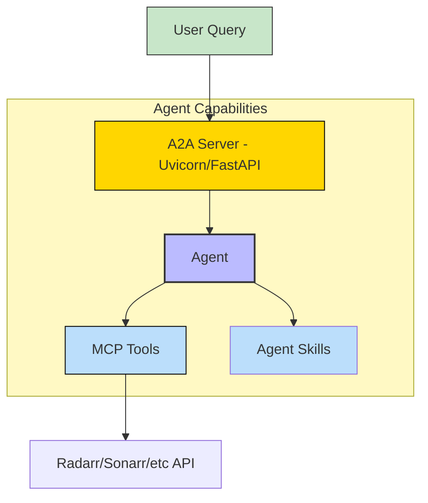
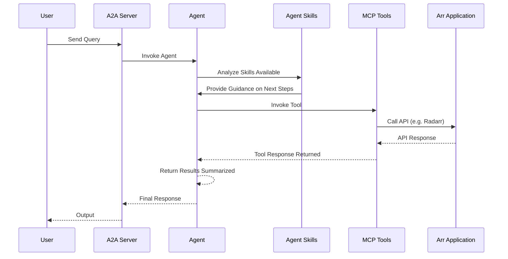

# Arr Stack - A2A | AG-UI | MCP


*Version: 0.2.17*

## Overview

Arr Stack MCP Server + A2A Server

It includes a Model Context Protocol (MCP) server and an out of the box Agent2Agent (A2A) agent.

This server acts as a unified proxy for the entire Arr stack, providing a single entry point for AI agents to interact with your media management services.

This repository is actively maintained - Contributions are welcome!

### Supports:
- **Radarr**: Movie collection management
- **Sonarr**: TV series management
- **Lidarr**: Music collection management
- **Prowlarr**: Indexer management
- **Chaptarr**: Book/Audiobook management
- Unified proxy architecture
- Centralized authentication

## MCP

### MCP Tools

Since this is a proxy server, it exposes all tools available from the connected Arr services.

| Service     | Description                                      | Tag(s)   |
|:------------|:-------------------------------------------------|:---------|
| `radarr`    | Tools for managing movies (add, search, monitor) | `movies` |
| `sonarr`    | Tools for managing TV shows (add, search, monitor)| `tv`     |
| `lidarr`    | Tools for managing music (add, search, monitor)  | `music`  |
| `prowlarr`  | Tools for managing indexers                      | `indexers`|
| `chaptarr`  | Tools for managing books and audiobooks          | `books`  |


### Using as an MCP Server

The MCP Server can be run in two modes: `stdio` (for local testing) or `http` (for networked access). To start the server, use the following commands:

#### Run in stdio mode (default):
```bash
arr-mcp --transport "stdio"
```

#### Run in HTTP mode:
```bash
arr-mcp --transport "http"  --host "0.0.0.0"  --port "8000"
```

AI Prompt:
```text
Find the movie Inception
```

AI Response:
```text
Found movie "Inception" (2010). It is currently monitored and available on disk.
```

## A2A Agent

This package also includes an A2A agent server that can be used to interact with the Arr MCP server.

### Architecture:



### Component Interaction Diagram



## Usage

### MCP CLI

| Short Flag | Long Flag                          | Description                                                                 |
|------------|------------------------------------|-----------------------------------------------------------------------------|
| -h         | --help                             | Display help information                                                    |
| -t         | --transport                        | Transport method: 'stdio', 'streamable-http', or 'sse' [legacy] (default: stdio) |
| -s         | --host                             | Host address for HTTP transport (default: 0.0.0.0)                          |
| -p         | --port                             | Port number for HTTP transport (default: 8000)                              |
|            | --auth-type                        | Authentication type: 'none', 'static', 'jwt', 'oauth-proxy', 'oidc-proxy', 'remote-oauth' (default: none) |
|            | --enable-delegation                | Enable OIDC token delegation                                                |
|            | --eunomia-type                     | Eunomia authorization type: 'none', 'embedded', 'remote' (default: none)   |

### A2A CLI
#### Endpoints
- **Web UI**: `http://localhost:8000/` (if enabled)
- **A2A**: `http://localhost:8000/a2a` (Discovery: `/a2a/.well-known/agent.json`)
- **AG-UI**: `http://localhost:8000/ag-ui` (POST)

| Short Flag | Long Flag         | Description                                                            |
|------------|-------------------|------------------------------------------------------------------------|
| -h         | --help            | Display help information                                               |
|            | --host            | Host to bind the server to (default: 0.0.0.0)                          |
|            | --port            | Port to bind the server to (default: 9000)                             |
|            | --reload          | Enable auto-reload                                                     |
|            | --provider        | LLM Provider: 'openai', 'anthropic', 'google', 'huggingface'           |
|            | --model-id        | LLM Model ID (default: qwen/qwen3-coder-next)                                  |
|            | --base-url        | LLM Base URL (for OpenAI compatible providers)                         |
|            | --api-key         | LLM API Key                                                            |
|            | --mcp-url         | MCP Server URL (default: http://localhost:8000/mcp)                    |
|            | --web             | Enable Pydantic AI Web UI                                              | False (Env: ENABLE_WEB_UI) |

### Agentic AI
`arr-mcp` is designed to be used by Agentic AI systems. It provides a set of tools that allow agents to manage your media library.

## Agent-to-Agent (A2A)

This package also includes an A2A agent server that can be used to interact with the Arr MCP server.

### Examples

#### Run A2A Server
```bash
arr-agent --provider openai --model-id gpt-4 --api-key sk-... --mcp-url http://localhost:8000/mcp
```

#### Run with Docker
```bash
docker run -e CMD=arr-agent -p 8000:8000 arr-mcp
```

## Docker

### Build

```bash
docker build -t arr-mcp .
```

### Run MCP Server

```bash
docker run -p 8000:8000 arr-mcp
```

### Run A2A Server

```bash
docker run -e CMD=arr-agent -p 8001:8001 arr-mcp
```

### Deploy MCP Server as a Service

The Arr MCP server can be deployed using Docker, with configurable authentication, middleware, and Eunomia authorization.

#### Using Docker Run

```bash
docker pull knucklessg1/arr-mcp:latest

docker run -d \
  --name arr-mcp \
  -p 8004:8004 \
  -e HOST=0.0.0.0 \
  -e PORT=8004 \
  -e TRANSPORT=http \
  -e AUTH_TYPE=none \
  -e CHAPTARR_MCP_URL=http://localhost:8060/mcp \
  -e LIDARR_MCP_URL=http://localhost:8061/mcp \
  -e PROWLARR_MCP_URL=http://localhost:8062/mcp \
  -e RADARR_MCP_URL=http://localhost:8063/mcp \
  -e SONARR_MCP_URL=http://localhost:8064/mcp \
  knucklessg1/arr-mcp:latest
```

#### Using Docker Compose

Create a `docker-compose.yml` file:

```yaml
services:
  arr-mcp:
    image: knucklessg1/arr-mcp:latest
    environment:
      - HOST=0.0.0.0
      - PORT=8004
      - TRANSPORT=http
      - AUTH_TYPE=none
      - CHAPTARR_MCP_URL=http://chaptarr:8060/mcp
      - LIDARR_MCP_URL=http://lidarr:8061/mcp
      - PROWLARR_MCP_URL=http://prowlarr:8062/mcp
      - RADARR_MCP_URL=http://radarr:8063/mcp
      - SONARR_MCP_URL=http://sonarr:8064/mcp
    ports:
      - 8004:8004
```

#### Configure `mcp.json` for AI Integration

```json
{
  "mcpServers": {
    "arr": {
      "command": "uv",
      "args": [
        "run",
        "--with",
        "arr-mcp",
        "arr-mcp"
      ],
      "env": {
        "RADARR_MCP_URL": "http://localhost:8063/mcp",
        "SONARR_MCP_URL": "http://localhost:8064/mcp"
      },
      "timeout": 300000
    }
  }
}
```

## Install Python Package

```bash
python -m pip install arr-mcp
```
```bash
uv pip install arr-mcp
```

## Repository Owners


